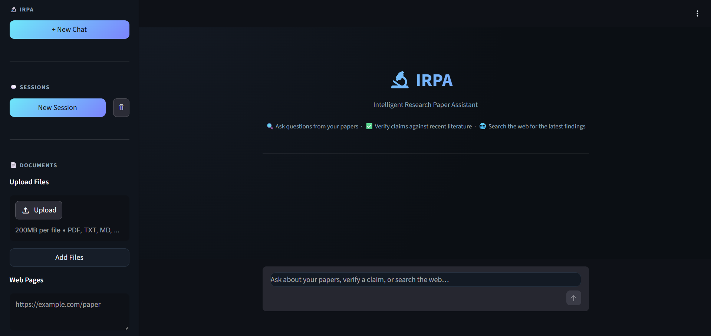

# <div align="center">🔬 IRPA : Intelligent Research Paper Assistant</div>

<div align="center">

[](http://13.61.235.217:8501/)
[](https://python.org)
[](https://langchain-ai.github.io/langgraph/)
[](https://hub.docker.com/r/octorohan/irpa-app)
[](https://aws.amazon.com/ec2/)
[](https://www.linkedin.com/in/rohan-datusalia-553ba02a2/)

**An Agentic RAG system for grounded research paper Q&A, real-time claim verification against modern literature, and multi-session literature review.**

[🚀 **Explore Live Demo**](http://13.61.235.217:8501/) • [📖 **Overview**](#-why-irpa-exists) • [✨ **Key Features**](#-key-features) • [🏛️ **Architecture**](#️-system-architecture) • [🛠️ **Tech Stack**](#-tech-stack) • [⚡ **Quickstart**](#-local-installation--setup)

---

</div>

## 💡 Why IRPA Exists

In AI & Machine Learning, research moves at breakneck speed. A foundational claim or benchmark established in a 2023 paper can be superseded within months by novel architectures and optimization techniques. 

Standard RAG chatbots merely tell you **what a paper argued**  they cannot tell you **whether that argument still holds up today**.

**IRPA treats *"Is this claim still true?"* as a first class citizen.** Instead of standard single hop retrieval, IRPA leverages an autonomous **LangGraph agent loop** to dynamically route queries, challenge assertions across live scientific publications via web search, detect retrieval degradation, and self correct on the fly.

---

## ✨ Key Features

| Capability | Description |
| :--- | :--- |
| ◫ **Multi-Source Ingestion** | Ingest local PDFs, Markdown, TXT, live web URLs, or directly pull papers from **arXiv** via paper ID / title. |
| ◈ **Autonomous Routing Loop** | Agentic router categorizes intents into **Direct Answer**, **Vector Store Retrieval**, or **Claim Verification**. |
| ✓ **Live Claim Verification** | Validates factual claims against recent literature via Tavily web search, highlighting superseded findings with direct citations. |
| ↺ **Self Correcting Retrieval** | A relevancy grading node detects poor chunks, triggering automated **query rewrites** and retries to avoid hallucinations. |
| ⊞ **Isolated Multi Session Memory** | Chat sessions maintain independent Qdrant vector collections and SQLite state checkpointers  preventing context bleed across papers. |
| ↳ **`/btw` Side Channel** | Ask quick, off-topic side queries without corrupting your active research session's conversational memory. |
|  **🗲 Disk Cached Embeddings** | Content chunks are SHA-256 hashed and cached locally to prevent redundant, costly embedding API re calls. |
|  **✦ Auto Named Threads** | Context-aware LLM generates concise, descriptive session titles from your initial query. |

---

## 🏛️ System Architecture

```text
                                ┌───────────────────────────┐
                                │   User / Streamlit UI     │
                                └─────────────┬─────────────┘
                                              │
                                              ▼
                                ┌───────────────────────────┐
                                │   LangGraph Agent Router  │
                                └──────┬──────┬──────┬──────┘
                                       │      │      │
             ┌─────────────────────────┘      │      └────────────────────────┐
             ▼                                ▼                               ▼
   ┌────────────────────┐          ┌────────────────────┐          ┌────────────────────┐
   │ Direct Answer Node │          │  Retrieval Agent   │          │ Claim Verification │
   └────────────────────┘          └──────────┬─────────┘          └──────────┬─────────┘
                                              │                               │
                                    ┌─────────┴─────────┐                     ▼
                                    ▼                   ▼           ┌───────────────────┐
                          ┌──────────────────┐ ┌──────────────────┐ │ Tavily Web Search │
                          │  Qdrant Vector   │ │ Tavily Search    │ └───────────────────┘
                          │   Collection     │ │ (Web Context)    │
                          └─────────┬────────┘ └──────────────────┘
                                    │
                                    ▼
                         [ Relevancy Evaluation ]
                                    │
                       ┌────────────┴────────────┐
                       │ (Pass)                  │ (Fail / Low Confidence)
                       ▼                         ▼
            ┌─────────────────────┐   ┌───────────────────────┐
            │   Generate Final    │   │ Query Rewrite & Retry │
            │ Grounded Answer     │   └──────────┬────────────┘
            └─────────────────────┘              │
                       ▲                         │
                       └─────────────────────────┘
```

> **State Persistence:** Conversational history, agent state checkpoints, and session metadata are persisted through an embedded SQLite checkpoint database alongside isolated Qdrant vector spaces.

---

## 🛠️ Tech Stack

| Layer | Technology | Rationale & Highlights |
| :--- | :--- | :--- |
| **Agentic Framework** | **LangGraph** | Explicit cyclical graph state machine with dynamic routing, retries, and fallback handling. |
| **LLM & Embeddings** | **Google Gemini** | High throughput `gemini-3.5-flash` for reasoning paired with native text embeddings. |
| **Vector Database** | **Qdrant Cloud** | Low latency vector search with per session collection isolation and payload filtering. |
| **Live Web Retrieval** | **Tavily Search API** | Optimized for agent workflows to discover recent counter evidence and fresh research. |
| **Evaluation Suite** | **DeepEval** | LLM assisted evaluation for Faithfulness, Answer Relevancy, and Contextual Precision. |
| **Frontend** | **Streamlit** | Fast, responsive chat UI featuring word by word streaming and instant access to verified sources. |
**Container & Cloud** | **Docker + AWS EC2** | Fully containerized environment deployed on an AWS EC2 instance. 

## 📸 Screenshots

<div align="center">

| Chat & Retrieval Interface |
| :---: | :---: |
|  |

</div>

---

## ⚡ Local Installation & Setup

### Prerequisites
* Python `3.10+`
* Git
* Qdrant Cloud Cluster & Google AI Studio API Key

### 1. Clone the Repository
```bash
git clone https://github.com/octorohan/IRPA.git
cd IRPA
```

### 2. Environment Setup
```bash
python -m venv venv
# On Windows:
.\venv\Scripts\activate
# On Linux/macOS:
source venv/bin/activate

pip install -r requirements.txt
```

### 3. Configure Credentials
Create a `.env` file in the root directory:

```env
GOOGLE_API_KEY="your_google_ai_studio_key"
TAVILY_API_KEY="your_tavily_search_key"
QDRANT_URL="https://your-cluster-id.eu-central-1-0.aws.cloud.qdrant.io"
QDRANT_API_KEY="your_qdrant_api_key"
APP_PASSWORD="your_secure_password"
```

### 4. Launch the Application
```bash
streamlit run app.py
```
Open your browser at `http://localhost:8501`.

---

## 🐳 Running with Docker

### Option A: Pull from Docker Hub (Recommended)

```bash
# 1. Create host storage directories
mkdir -p ~/irpa-data/embedding_cache
touch ~/irpa-data/sessions.json
touch ~/irpa-data/checkpoints.db

# 2. Run container
docker run -d \
  -p 8501:8501 \
  --env-file .env \
  -v ~/irpa-data/embedding_cache:/app/embedding_cache \
  -v ~/irpa-data/sessions.json:/app/sessions.json \
  -v ~/irpa-data/checkpoints.db:/app/checkpoints.db \
  --restart unless-stopped \
  --name irpa-app \
  octorohan/irpa-app:latest
```

### Option B: Build Locally
```bash
docker build -t irpa-app .
docker run -d -p 8501:8501 --env-file .env --name irpa-app irpa-app
```

---

## 📊 Evaluation & Benchmarking

IRPA integrates **DeepEval** to quantitatively grade RAG pipelines using LLM-as-a-Judge against synthetic golden datasets generated from ingested research papers:

```bash
python evaluate.py
```

* **Faithfulness Metric:** Ensures answers are strictly grounded in retrieved research context.
* **Answer Relevancy:** Measures whether responses directly address user questions.
* **Contextual Precision & Recall:** Validates that retrieved chunks are dense in signal and noise-free.

---

## 📂 Project Structure

```text
IRPA/
├── app.py                  # Streamlit application entry point & UI
├── backend/
│   ├── vector_store.py     # Qdrant client, isolated collections & disk-caching
│   ├── rag_graph.py        # LangGraph state machine, agent nodes & dynamic router
│   ├── paper_loader.py     # Document loaders (PDF, Web scraping, arXiv API)
│   ├── btw_handler.py      # /btw side-channel conversational memory logic
│   └── models.py           # Pydantic data schemas & state models
├── documents/               # Sample research benchmarks & papers
├── evaluate.py              # DeepEval testing harness
├── Dockerfile               # Production container image specification
├── DOCKER_GUIDE.md          # Comprehensive AWS EC2 & Docker deployment guide
├── requirements.txt         # Project dependencies
└── README.md
```

---

## 📌 Known Considerations

* **Quota Throttling:** Running on shared API free tiers may hit rate limits during heavy concurrent chunking.
* **Qdrant Cloud Inactivity:** Free-tier clusters may hibernate after extended inactivity.
* **Session Teardown:** Deleting a session from the UI currently retains historical checkpoint entries in SQLite.

---

## 👨‍💻 Author & Contact

Built with ❤️ by **Rohan Datusalia**

<div align="left">

[](https://www.linkedin.com/in/rohan-datusalia-553ba02a2/)
[](mailto:rohanforprogramming@gmail.com)
[](http://13.61.235.217:8501/)

</div>

---

<div align="center">
⭐ If you find this project helpful, please consider starring the repository!
</div>
